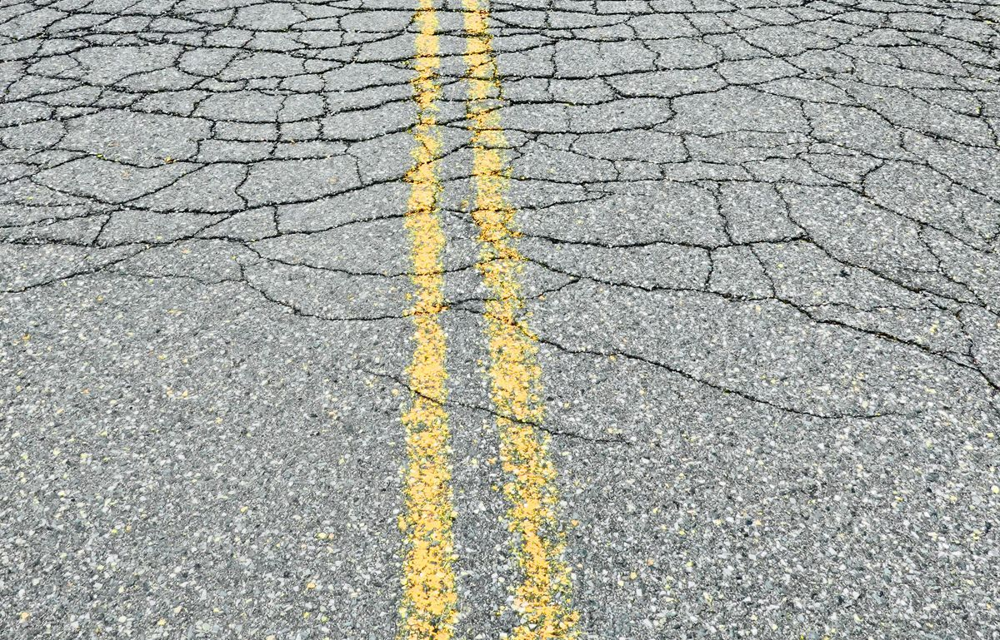
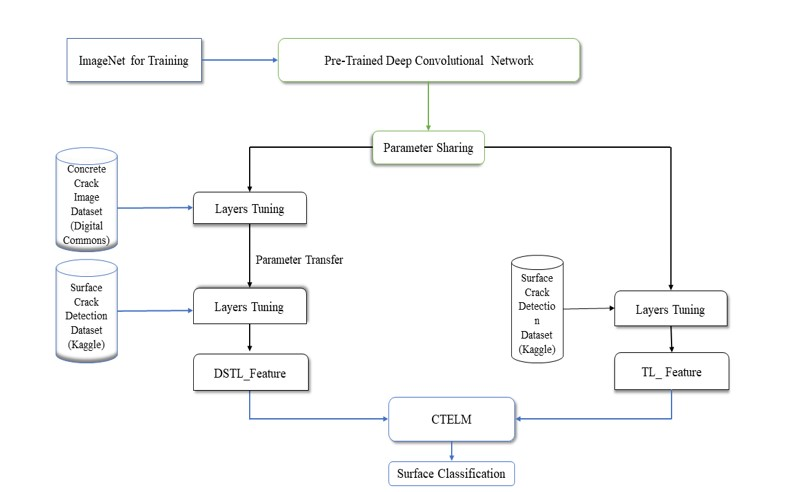
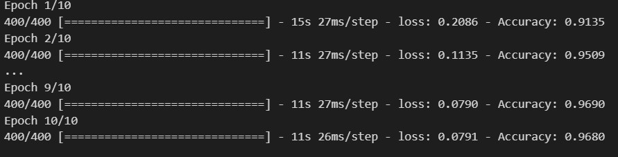

# Crack-Detection-using-Transfer-Learning-ResNet50-

As time progresses, a vast number of buildings, highways, and bridges are being built around the world. Cracks are frequently seen on various services and infrastructure for, example, roads, bridges, and tunnels Commercial and civil structures. Some of them are harmful and others are not known to be flaws because they are minor, but they are still a potential risk for causing a major disaster if we neglect them. Architectural objects and civil infrastructures are vulnerable to structural failure due to both the degradation of materials in time and structural problems such as natural disasters. Structural building monitoring and evaluation are of paramount importance both for ensuring the lifetime of the buildings and for forecasting future failures. Although much of the inspection is carried out using manual observations, there are many drawbacks of manual observation. These physical survey approaches have low accuracy and reliability, require needless time, take vast quantities of labour, and place surveyors in dangerous circumstances. Depending on the geomorphologic and area characteristic of the surface cracks, more inherent damage possible causes can be identified, which gives fair guidelines on the evaluation of the structure and specifications. Advances in technology and, robotics, and image capture equipment make it possible to capture autonomous data while deep learning and algorithms in image processing are promising to conduct a truly autonomous evaluation of structures. The application of deep learning for crack detection on a concrete structure in this task not only decreases processing time but also allows reliable calculation of features to be examined without human error. Deep learning algorithms mean to outcome the exiting limitation in crack detection using image processing. Deep learning algorithms to detect damage such as a crack in concrete robustly and reliably.

This project is aimed at detecting cracks in images using transfer learning with ResNet50. Cracks in buildings and infrastructure can be a serious problem that can lead to safety issues and costly repairs. However, detecting cracks manually can be time-consuming and difficult. This project uses a pre-trained ResNet50 model, which has been fine-tuned on a dataset of images containing cracks and non-cracks, to detect cracks in new images.
The code in this repository includes the script for training the ResNet50 model on the dataset, as well as the script for using the trained model to detect cracks in new images. The dataset used for training and testing the model is also included.
This project can be useful for anyone who needs to detect cracks in images, whether it be for building inspections, infrastructure maintenance, or any other application.
## Flow Diagram

## Dataset
The dataset used in this project was downloaded from Kaggle and consists of 40,000 images of building surfaces. The dataset is divided into two classes: positive and negative. The positive class contains 20,000 images of building surfaces with visible cracks, while the negative class contains 20,000 images of building surfaces without visible cracks.
The images in the dataset are of various sizes and resolutions. To prepare the images for training the ResNet50 model, they were resized to 224x224 pixels and normalized.
The dataset is included in this repository under the dataset directory. The positive and negative images are stored in separate subdirectories, dataset/positive and dataset/negative, respectively.
This dataset can be used to train and evaluate models for detecting cracks in building surfaces. However, it is important to note that the dataset may not be representative of all real-world scenarios and may require additional data to improve model performance.
  

## Accuracy

## Loss Graph

